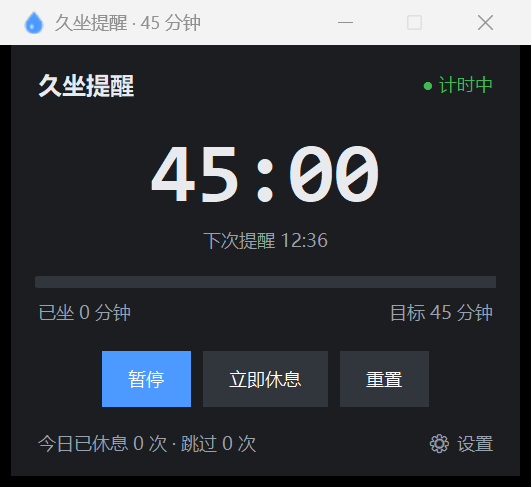
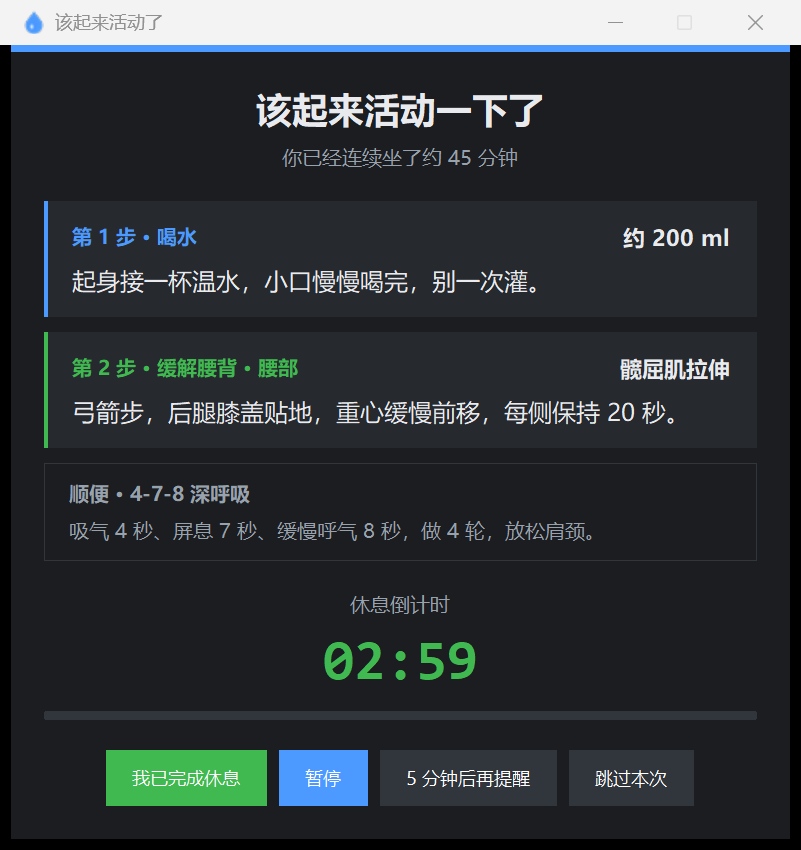
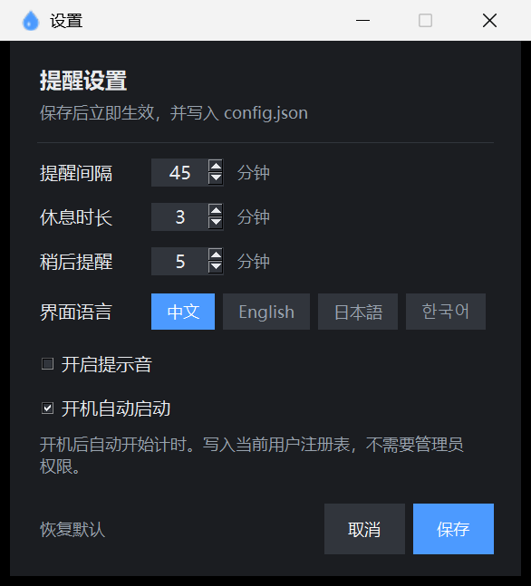
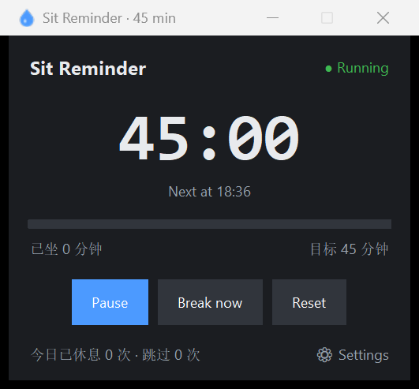
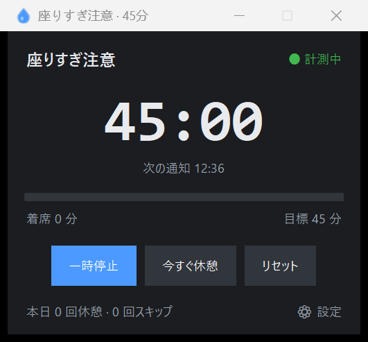
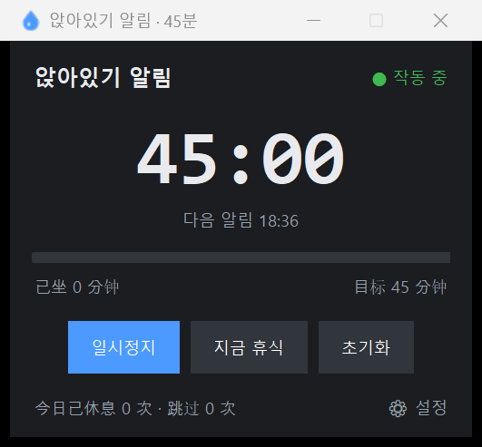

# 久坐提醒助手 · Sit Reminder

> 一个零依赖的 Windows 桌面小工具：每 45 分钟提醒你起身喝水、顺手做一个缓解腰背酸痛的小动作。

纯 Python 标准库（`tkinter`）写成，**不装任何第三方包**，克隆下来双击就能跑。支持 **中文 / English / 日本語 / 한국어** 四种界面语言，可开机自启。

<p align="center">
  
  
  
</p>

---

## 它解决什么问题

久坐最伤的是腰。多数提醒软件只会弹一句"该喝水了"，但真正需要的是 **一条具体能做的动作**、一个明确的休息时长，以及一个不会打扰到烦人的节奏。

这个工具的做法是：计时到点 → 弹出一个小卡片 → 上面写着"第 1 步 · 喝水"和"第 2 步 · 缓解腰背 · 站姿后仰伸展"，并给出具体做法 → 你完成后点一下，休息倒计时结束自动回到计时状态。

## 功能

| 功能 | 说明 |
| --- | --- |
| ⏱ 提醒间隔 | 默认 45 分钟，可设 1–240 分钟 |
| 🧘 动作库 | 13 个动作，涵盖腰背 / 侧腰 / 肩颈 / 下肢循环四类，随机不重复 |
| 👀 顺便一条 | 每次附赠 1 条小习惯（20-20-20 远眺、4-7-8 深呼吸、收下巴、转脚踝） |
| ⏳ 休息时长 | 默认 3 分钟，可设 1–30 分钟，带倒计时 |
| 💤 稍后提醒 | 默认 5 分钟，可设 1–60 分钟 |
| ⏸ 暂停 / 继续 | 开会、专注时一键暂停，不丢当前进度 |
| 📊 今日统计 | 记录今天休息了几次、跳过了几次 |
| 🔔 提示音 | 可开关 |
| 🪟 位置记忆 | 主窗口拖到哪儿下次就还在哪儿 |
| 🚀 开机自启 | 写当前用户注册表，免管理员；路径失效能自动识别 |
| 🌐 四语言 | 中文 / English / 日本語 / 한국어，设置里点了立即切换，默认跟随系统 |
| 🖥 高 DPI | 自动按屏幕缩放比例调整尺寸，2K/4K 屏不发虚不折行 |

## 快速开始

### 方式一：直接跑源码（推荐，最简单）

需要 Python 3.8+（Windows 官方安装包自带 `tkinter`）。

```bash
git clone https://github.com/whuang666/sit-reminder.git
cd sit-reminder
```

然后 **双击 `start.bat`** 即可。它会自动在系统里找 `pythonw.exe`，找到就静默启动（不弹黑窗）。

也可以在命令行手动启动：

```bash
pythonw water_break_reminder.py
```

### 方式二：用 exe（不想装 Python）

从 [Releases](../../releases) 下载 `SitReminder.exe`，双击运行。单文件绿色版，不需要安装。

想自己打包：

```bash
pip install pyinstaller
python build_exe.py
```

产物在 `dist/SitReminder.exe`。

## 界面语言

设置里一排语言标签，点一下立即切换，不用重启：

| 中文 | English | 日本語 | 한국어 |
| --- | --- | --- | --- |
|  |  |  |  |

首次运行默认跟随系统的显示语言；识别不出来就用中文。选择会记到 `config.json`，也可以直接用命令行参数覆盖：

```bash
pythonw water_break_reminder.py --lang=en
```

## 配置文件

所有设置存在程序同目录的 `config.json`，首次运行自动生成：

```json
{
  "work_minutes": 45,
  "break_minutes": 3,
  "snooze_minutes": 5,
  "sound": true,
  "lang": null,
  "pos": null,
  "stats": {}
}
```

- `lang` 为 `null` 表示跟随系统，也可写 `"zh"` / `"en"` / `"ja"` / `"ko"`
- `pos` 是上次的窗口位置，不用手改
- `stats` 是今日统计，跨天自动重置

想恢复出厂设置，删掉 `config.json` 重启即可。

## 开机自启

在设置里勾选「开机自动启动」并保存。原理是往注册表写入一条启动项：

```
HKCU\Software\Microsoft\Windows\CurrentVersion\Run
  WaterBreakReminder = "...\pythonw.exe" "...\water_break_reminder.py"
```

只写当前用户（HKCU），**不需要管理员权限**，也不改系统服务。如果之后把文件夹搬了位置，勾选框会自动识别为「路径已失效」并提示重新保存修复。

也可以直接用根目录的两个批处理：`开机自启-开启.bat` / `开机自启-关闭.bat`。

## 项目结构

```
.
├── water_break_reminder.py     # 主程序（界面 + 计时 + 自启）
├── i18n.py                     # 四语言文案与字体选择
├── start.bat                   # 双击启动
├── build_exe.py                # PyInstaller 打包脚本
├── build.bat                   # 双击打包
├── app.ico                     # 图标
├── config.example.json         # 配置示例
├── 开机自启-开启.bat           # 注册自启
├── 开机自启-关闭.bat           # 取消自启
├── _smoke_test.py              # 13 项功能冒烟测试
├── screenshots/                # 四语言界面截图
├── .github/workflows/release.yml   # 打 tag 自动构建并发布 exe
└── tools/
    ├── autostart.py            # 命令行管理自启（status / on / off / verify）
    ├── capture_ui.py           # 无遮挡截图（PrintWindow）
    ├── verify_layout.py        # 穷举排版校验
    ├── dpi_probe.py            # DPI 模式诊断
    └── make_icon.py            # 生成 app.ico
```

## 开发者说明

几个实现上踩过的坑，供参考：

- **高 DPI**：`tkinter` 的字体单位是"点"，会随系统缩放自动放大，但像素尺寸不会。所以所有像素尺寸都过一遍 `P(n) = round(n * k)`，`k` 由 `tk scaling` 推出来，否则 150% 缩放下文案会大面积折行。
- **窗口高度自适应**：先 `withdraw()`，建完控件再 `update_idletasks()` 量 `winfo_reqheight()`，最后 `geometry()` + `deiconify()`，避免创建时尺寸闪跳。
- **验证脚本**：`tools/verify_layout.py` 会穷举 4 语言 × 13 动作 × 4 顺便 = 208 种组合，逐个检测有没有内容溢出，改完文案跑一遍就行。
- **自启验证**：`python tools/autostart.py verify` 会用 `--selftest` 真的按注册命令拉起一次程序，确认能正常启动。

## 常见问题

**双击 `start.bat` 一闪而过？**
说明没找到 Python，或装的时候没勾「Add to PATH」。用命令 `python --version` 确认一下，或者直接用 exe 版。

**报 `No module named tkinter`？**
装 Python 时把「tcl/tk and IDLE」勾上；conda 环境一般自带。

**弹窗被挡住 / 全屏游戏里看不到？**
弹窗是置顶的，但独占全屏的窗口会盖住它。切窗口化或无边框全屏即可。

## License

[MIT](LICENSE) © 2026 whuang666

---

# Sit Reminder (English)

A zero-dependency Windows desktop widget that nudges you to **stand up, drink water, and do one quick stretch for your lower back** every 45 minutes.

Written with nothing but the Python standard library (`tkinter`) — no pip install needed. Ships with **Chinese / English / Japanese / Korean** UI, and can start automatically at logon.

### Features

- Configurable interval (1–240 min, default 45), break length (1–30 min), snooze (1–60 min)
- 13 randomized stretches covering lower back, obliques, neck/shoulders and circulation — each with concrete instructions
- One extra micro-habit per reminder (20-20-20 eye rest, 4-7-8 breathing, chin tuck, ankle circles)
- Pause / resume, skip, break-now, daily stats, sound toggle, window position memory
- Start at logon via `HKCU\...\Run` — no admin rights, detects broken paths
- Per-monitor DPI aware; stays crisp on 2K/4K displays

### Run

```bash
git clone https://github.com/whuang666/sit-reminder.git
cd sit-reminder
pythonw water_break_reminder.py      # or double-click start.bat
```

Package a standalone exe:

```bash
pip install pyinstaller && python build_exe.py
```

### License

[MIT](LICENSE)
